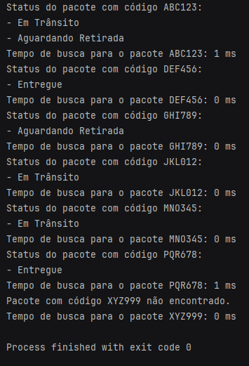

# Sistema de Rastreamento

Este repositório contém uma implementação em Kotlin de um sistema de rastreamento que permite aos usuários adicionar pacotes e procurá-los usando seus códigos de rastreamento. O sistema utiliza uma estrutura de dados HashMap com um algoritmo de busca baseado em hash para melhor desempenho.

## Explicação do Código

O código consiste em duas partes principais:

1. **Classe de Dados Package:**
    - A classe de dados `Package` representa um pacote com seu código de rastreamento e status.

2. **Classe TrackingSystem:**
    - A classe `TrackingSystem` gerencia a funcionalidade do sistema de rastreamento.
    - Ela contém um HashMap chamado `packageMap` para armazenar os pacotes. As chaves são os códigos de rastreamento e os valores são listas de pacotes associadas a cada código de rastreamento.
    - A função `addPackage` adiciona um pacote ao sistema. Se um pacote com o mesmo código de rastreamento já existir, o novo pacote será adicionado à lista de pacotes associada a esse código de rastreamento.
    - A função `searchPackages` realiza uma busca otimizada por pacotes com um determinado código de rastreamento. Ela recupera diretamente a lista de pacotes associada ao código de rastreamento do HashMap.

## Por que a Busca Baseada em Hash?

Um algoritmo de busca baseada em hash é utilizado porque ele fornece uma complexidade de tempo constante em média para recuperar elementos do HashMap. Isso significa que, independentemente do número de pacotes armazenados no sistema, o tempo necessário para buscar um pacote permanece constante em média, tornando-o altamente eficiente mesmo para grandes conjuntos de dados.

## Uso

Para utilizar o sistema de rastreamento:

1. Crie uma instância da classe `TrackingSystem`.
2. Adicione pacotes usando a função `addPackage`.
3. Procure por pacotes usando a função `searchPackages`.

## Exemplo

```kotlin
val trackingSystem = TrackingSystem()

// Adicionando pacotes ao sistema
trackingSystem.addPackage(Package("ABC123", "Em Trânsito"))
trackingSystem.addPackage(Package("DEF456", "Entregue"))

// Procurando por pacotes
val searchResults = trackingSystem.searchPackages(trackingCode)
```

## Executando o Exemplo

Para executar o código de exemplo fornecido, execute a função `main` definida no pacote `search`. Isso demonstrará como adicionar pacotes ao sistema e realizar buscas, com os resultados impressos no console.

```kotlin
package search

fun main() {
    // Código de exemplo fornecido
}
```

## Resultado


## Observações
- Esta implementação assume códigos de rastreamento exclusivos para cada pacote. Se múltiplos pacotes com o mesmo código de rastreamento forem adicionados, todos eles serão associados a esse código de rastreamento.
- Para aplicações do mundo real, podem ser necessárias funcionalidades adicionais, como tratamento de erros, integração com banco de dados e interfaces de usuário.
- A busca baseada em hash é uma escolha eficiente para este sistema de rastreamento devido à sua rápida complexidade de tempo de execução e sua capacidade de lidar com grandes conjuntos de dados de forma eficiente.

Esse README fornecerá uma visão mais aprofundada sobre a escolha da busca baseada em hash e explicará sua eficiência em tempo de execução para o sistema de rastreamento.
