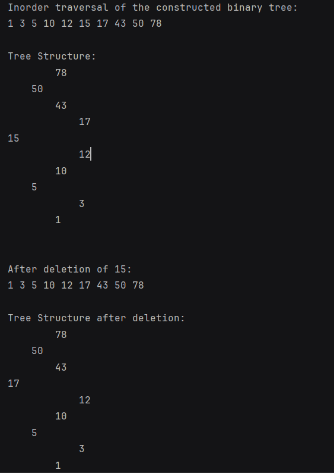

# Árvore Binária Balanceada em Kotlin

Este projeto implementa uma árvore binária balanceada em Kotlin. A árvore binária é uma estrutura de dados hierárquica que permite armazenar e manipular dados de forma eficiente.

## Estrutura do Projeto

O projeto está organizado da seguinte maneira:

- **tree**: Contém as classes relacionadas à implementação da árvore binária.
  - **data**: Contém a classe `TreeNode`, que representa um nó na árvore binária.
  - **functions**: Contém as classes que implementam as operações na árvore, como inserção, exclusão e travessias.
- **Main.kt**: Contém um exemplo de utilização da árvore binária.

## Funcionalidades Implementadas

O projeto inclui as seguintes funcionalidades:

1. **Inserção de elementos**: A classe `TreeInsertion` implementa a inserção de elementos na árvore binária. Ela utiliza rotações para manter a árvore balanceada após a inserção de um novo elemento.

2. **Remoção de elementos**: A classe `TreeDelete` implementa a remoção de elementos da árvore binária. Ela também utiliza rotações para manter o balanceamento da árvore após a remoção de um elemento.

3. **Travessia da árvore**: A classe `TreeFetch` implementa métodos para realizar a travessia da árvore em ordem e para imprimir a estrutura da árvore de forma visual.

4. **Impressão da árvore**: A classe `TreeFetch` também fornece um método para imprimir a estrutura da árvore de forma visual, facilitando a visualização da árvore.

## Detalhes da Implementação

### Classe TreeNode

A classe `TreeNode` representa um nó na árvore binária. Ela possui os seguintes campos:

- `data`: O valor armazenado no nó.
- `left` e `right`: Referências para os nós filhos esquerdo e direito, respectivamente.
- `height`: A altura do nó na árvore.

### Funções de Inserção

A classe `TreeInsertion` implementa a inserção de elementos na árvore binária. Ela utiliza rotações para manter a árvore balanceada após a inserção de um novo elemento.

### Funções de Remoção

A classe `TreeDelete` implementa a remoção de elementos da árvore binária. Ela também utiliza rotações para manter o balanceamento da árvore após a remoção de um elemento.

### Travessias e Impressão da Árvore

A classe `TreeFetch` implementa métodos para realizar a travessia da árvore em ordem e para imprimir a estrutura da árvore de forma visual.
Aqui está uma captura de tela da impressão da árvore no console:

### Classe BinaryTree

A classe `BinaryTree` representa a própria árvore binária e fornece métodos públicos para realizar operações na árvore, como inserção, remoção e travessias.

## Como Utilizar

Para utilizar a árvore binária balanceada, siga estes passos:

1. Clone este repositório.
2. Compile e execute o arquivo `Main.kt`.
3. Observe os resultados da inserção, remoção e travessia da árvore binária.

## Exemplo de Utilização

Um exemplo de utilização da árvore binária está presente no arquivo `Main.kt`. Nesse exemplo, são inseridos alguns elementos na árvore e são realizadas operações de travessia e remoção.

## Contribuindo

Contribuições são bem-vindas! Se você encontrar algum problema ou tiver alguma sugestão de melhoria, sinta-se à vontade para abrir uma issue ou enviar um pull request.